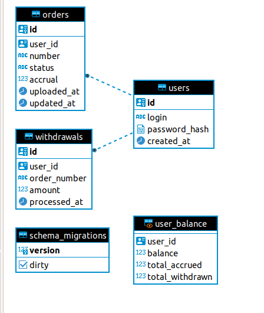

# Gophermart

Pet project сервиса накопительной системы магазина. 

## Схема БД

## Описание таблиц

В таблице users хранятся данные о пользователях. Она связана с другими таблицами связью 1 ко многим. В таблице orders информациях о заказах пользователя. Поле accrual (рассчитанные баллы) обновляется, когда мы получаем, что расчет заказа окончен. Таблица withdrawals - информация о списаниях средств. Здесь хранится история списаний